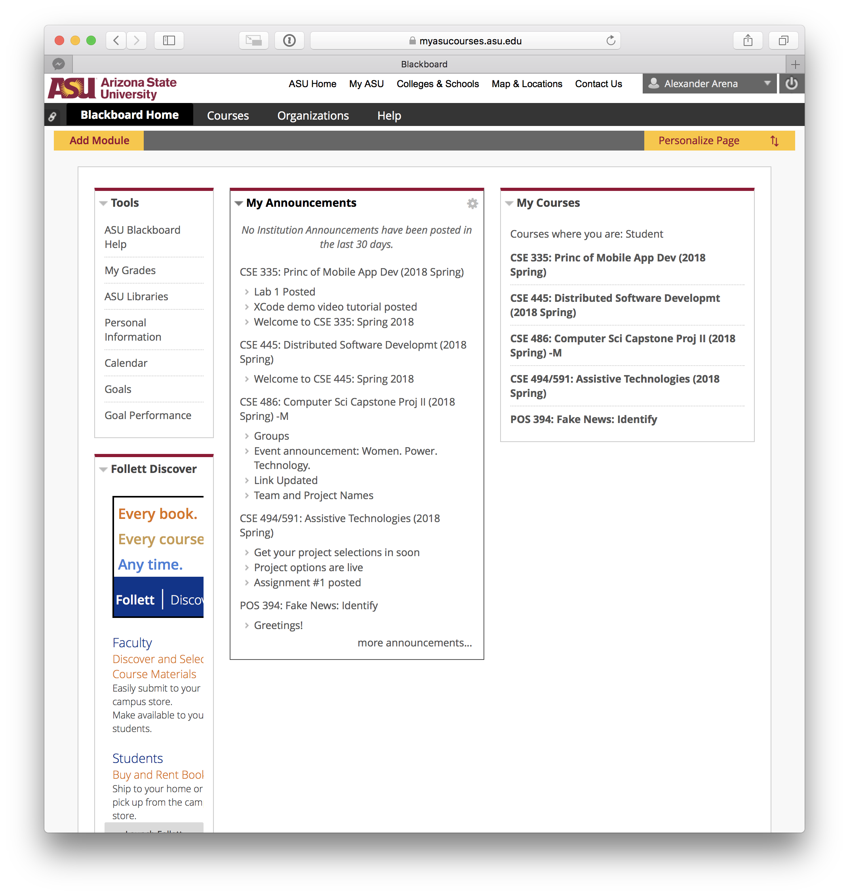
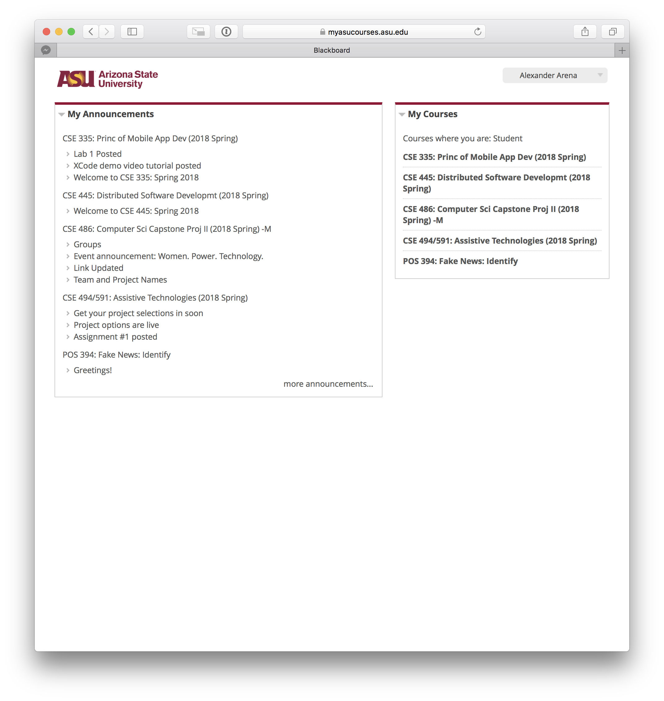

# MinimalBB
This Safari extension is designed to remove UI clutter from the notoriously terrible ASU Blackboard. You could probably repurpose it to work with Blackboard sites from other schools, but it only works at ASU out of the box.

| Before | After |
|--------|-------|
|  |  |

**Disclaimer**
You should disable this extension while taking quizzes/tests. It hides UI elements that I *think* are largely useless, but the unintended consequences of this could be bad if you're in the middle of a test.
